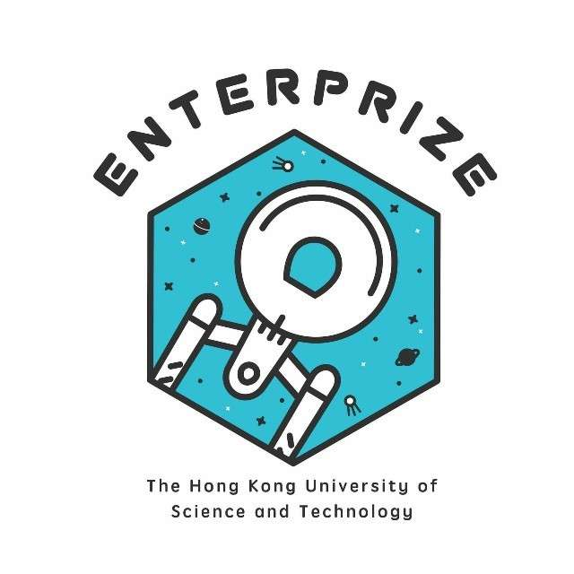
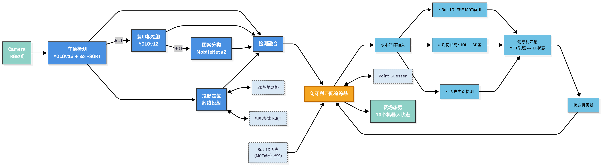
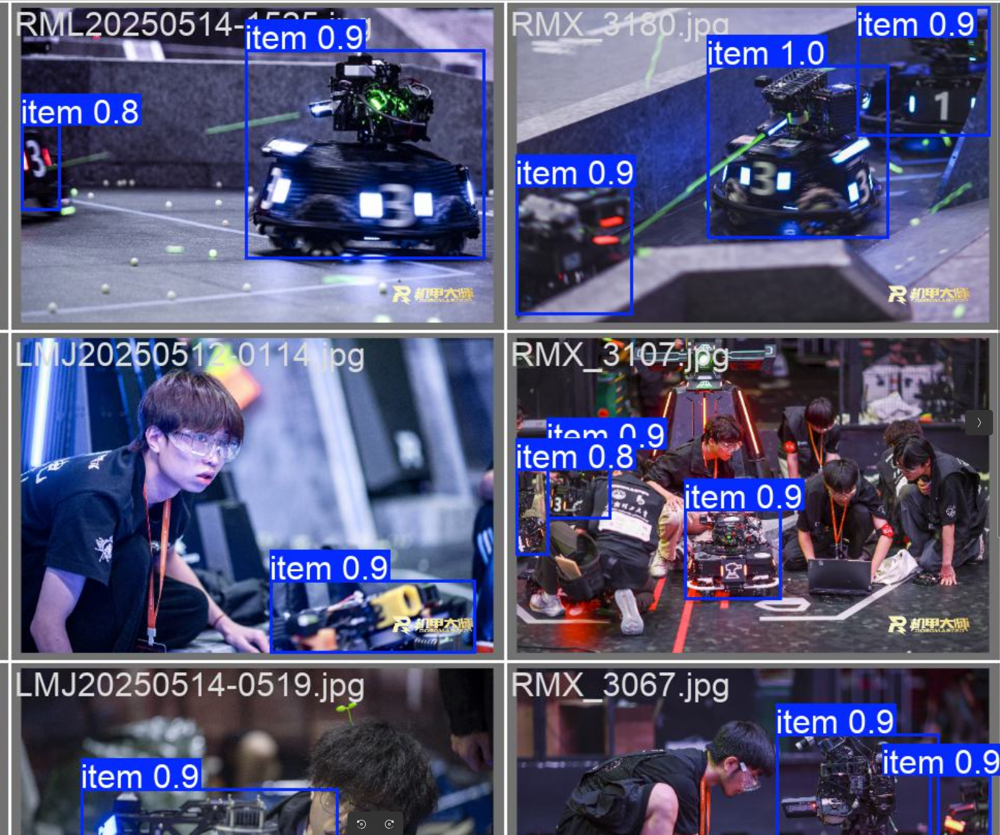
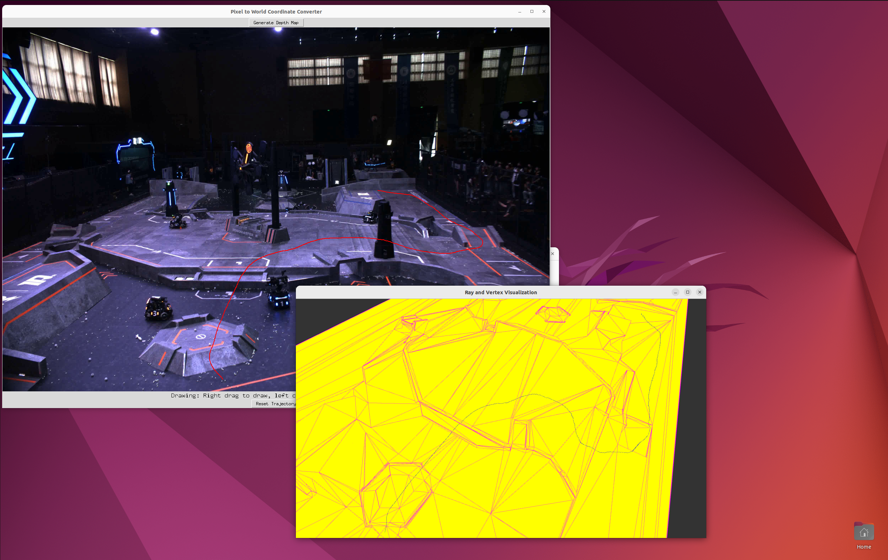
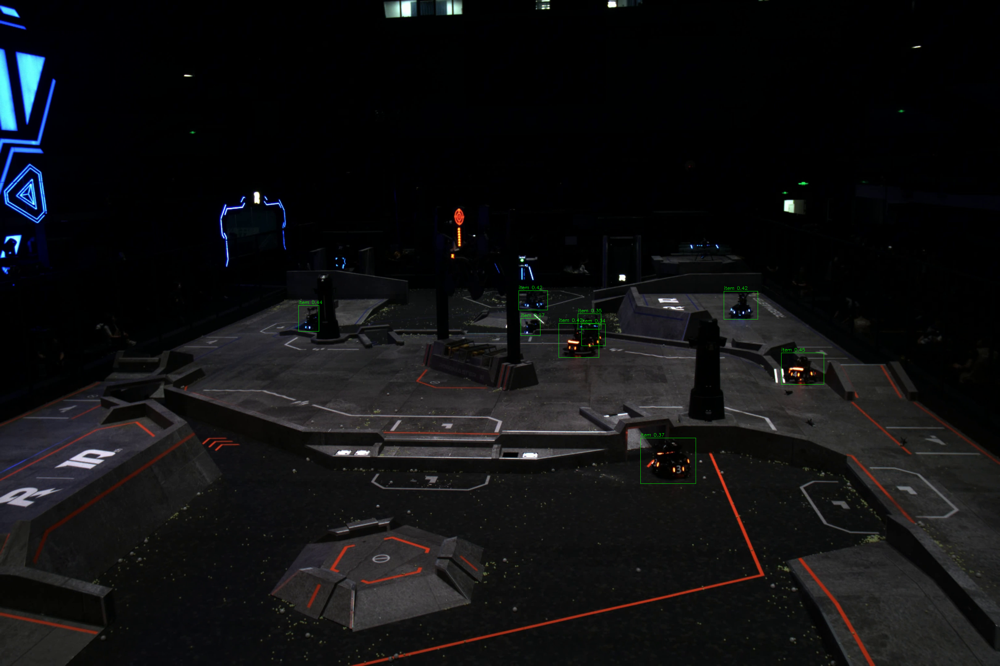
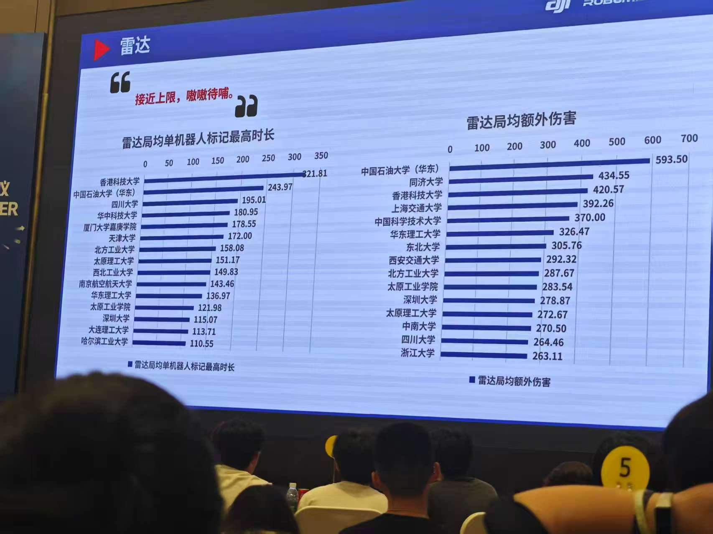

# HKUST ENTERPRIZE RoboMaster 2025 Radar Algorithm
<p align="center">
<a href="./LICENSE"></a>
</p>

<p align="center">
  
</p>

## 效果演示

*系统运行效果演示*
## 更新日志
- `2025.8.3`: 第一版项目代码Released🎉🎉🎉
- `2025.8.9`: 
  
  - 删除掉无用的config文件(`config/armor.yaml`,`config/car.yaml`)
  - 加入参考*Ultralytics*的训练配置文件: `./config/armor_training_config.yaml` `./config/car_training_config.yaml`
  - 我们开源了`Car Detector`,`Armor Detector`以及`Pattern Classifier`相关数据集, 以供大家学习交流分享🎉🎉🎉
  - 我们更新了装甲板分类器的训练代码以及指南
  - Release了*射线投影(ray-cast)*的可视化交互式脚本以及使用指南 


## 开源协议
本项目基于[MIT许可证](LICENSE)开源。引用时请注明项目来源：香港科技大学ENTERPRIZE战队RoboMaster 2025雷达站算法开源项目。


## 项目概述

雷达站作为RoboMaster比赛中的关键辅助兵种，需要在复杂赛场环境中稳定追踪双方机器人的运动状态。本系统通过创新的算法设计，解决了传统方案在遮挡处理、非平面场地定位、身份持续追踪等方面的痛点，在2025赛季复活赛中表现优异，助力战队取得单局最高1912.1s易伤时间、局均1618.3s易伤时间和420.2额外伤害的成绩。

- *( 如果你对我们的实现原理感兴趣, 请参考我们的官方技术报告来了解详细技术细节)*

**核心功能**：
- 高精度机器人检测（支持遮挡、低光照等复杂场景）
- 三维空间精准定位（适配多层台阶、斜坡等非平面场地）
- 稳定的多目标追踪（解决快速移动、临时遮挡导致的身份混淆）
- 战术辅助数据输出（为决策系统提供实时轨迹与状态信息）


## 算法流程


*图1：雷达站算法整体流程*

系统分为两大核心模块：
1. **检测模块（Detector）**：基于深度学习模型提取机器人及装甲板信息
2. **追踪模块（Tracker）**：通过匹配算法维持目标身份与轨迹连续性


## 核心技术亮点

### 1. 专用数据集构建

针对比赛场景特点，构建包含复杂工况的高质量数据集：
- 数据来源：官方直播图像、各战队开源第一视角视频
- 标注内容：机器人整体框、装甲板位置、颜色、存活状态（含死亡状态标注）
- 关键优化：引入天然遮挡样本（非人工mask增强），显著提升模型鲁棒性


*图2：含遮挡场景的数据集样本与标注效果。从官方的图片直播中获取了大量带机器人遮挡的原始数据并进行了人工标注，相比训练时引入遮挡等数据增强，天然的遮挡训练集能大大增加模型对赛场复杂情况下的适应性。*

### 2. 多层检测网络

采用三级检测架构，平衡精度与速度：
- **机器人检测**：`YOLOv12-s` 模型（输入1280×1280），优化小目标检测能力
- **装甲板检测**：`YOLOv12-n` 模型（输入192×192），输出位置与状态信息
- **图案分类**：`MobileNetv2` 轻量网络（输入64×64），分类准确率达99.99%


### 3. 射线投射定位法

创新的三维定位方案，解决传统透视变换在非平面场地的局限性：
- 原理：从相机光心发射射线，与预加载的场地3D网格模型求交，获取世界坐标
- 优势：
  - 无需分层处理，直接适配高地、台阶等复杂地形
  - 输出完整三维坐标`（X, Y, Z）`，而非仅平面坐标
  - 标定简单（仅需6个非共面点），适应比赛前快速部署

#### 与传统方案对比

| 方案 | 优势 | 局限性 |
|------|------|--------|
| 传统透视变换 | 计算简单 | 依赖平面假设，非平面区域误差大 |
| 多层透视变换 | 支持简单分层场地 | 层间交界模糊，需大量标定 |
| 本方案射线投射 | 精准适配3D场地，无需分层 | 依赖精确场地模型 |

#### 射线投影可视化demo
**Pre-requisite**
```shell
pip install open3d 
```
1. ❗❗找到, 根据指示将实际上场相机参数(transform.K, transform.dist_coffs)替换为demo用参数
2. 运行代码 `python -m transform.ray_renderer`
3. 根据指示, 在图片界面左键发射一条光线, 右键绘制轨迹, 实际投影呈现的效果会显示在3D图示中



### 4. 匈牙利匹配追踪算法

基于固定目标池（10个兵种）的多目标追踪策略：
- 融合多维度匹配线索：历史类别置信度、IoU重叠度、3D位置距离、短期轨迹ID
- 状态机管理：INACTIVE→TENTATIVE→CONFIRMED→LOST四状态流转，应对遮挡与丢失
- 猜点逻辑：结合卡尔曼滤波速度预测，在目标丢失时基于运动趋势猜测位置


## 硬件要求

- **GPU**：推荐RTX3060及以上（实测RTX5070/4060笔记本可稳定运行，帧率~10fps）
- **相机**：推荐高分辨率工业相机


**上场设备**(仅供参考)

- 运算端: `机械革命蛟龙16Pro/2025/RTX5070`
- 工业相机: `海康机器人工业相机2000万像素/USB3.0/MV-CS200-10UC`
- 工业镜头: `海康机器人2500万工业镜头/MVL-KF1224M-25MP1624c`


## 快速开始

### 环境配置

- 目前配置环境仅支持**Ubuntu 22.04**
- 点击这里配置环境: [Environment Setup](./docs/env.md)

### 简易训练指南

**数据集链接:** [ENTERPRIZE战队2025赛季开源数据集(密码:987654321)](https://hkustconnect-my.sharepoint.com/:f:/g/personal/zguobd_connect_ust_hk/EvYDNGry-DBBjr9eSzpacGcBPlSS7KpMZmSE3KGzeJMJKw)

***Remark***: 为了达到最佳的训练效果, 请不要**仅仅**依赖于我们提供的数据集进行训练, 可以参考我们在报告中提到的数据集制作思路自主标注相关数据; 本数据集开源仅作为参考

1. 一阶段机器人(车辆)识别数据:

    - 共计**3022**个数据 
    - *标签定义*: 0 -> 机器人

2. 二阶段装甲板识别数据:
    - 共计**3504**个数据
    - *标签定义*: 0 -> 死亡状态装甲板; 1 -> 红色灯条装甲板; 2 -> 蓝色灯条装甲板

3. 三阶段装甲板图案识别数据:
    - 共计**3528**个数据
    - *标签定义*： 首字母B/R -> 蓝色/红色（训练中会自动混合）； 第二个字符： 0 -> 前哨站； 1-5 -> 1-5号装甲板（5号不会参与训练，但是在此仍提供出来）; S（6） -> 哨兵

#### Car Detector:
- 使用Ultralytics的训练接口
- 训练config参考 `./config/car_training_config.yaml`


*只使用我们开源训练集进行Car Detector的训练,复现效果如图所示*

#### Armor Detector:
- 使用Ultralytics的训练接口
- 训练config参考: `./config/armor_training_config.yaml`


#### MobileNET-v2
训练代码
```python
python -m model.digit_classifier.train --dataset-path /path/to/your/dataset --batch-size 32
```
*其中数据集格式要求为*
``` shell
/dataset
  /train
    /B1
    /B2
    /B3
    ...
    /R1
    /R2
    /R3
    ...
  /val
    /B1
    /B2
    /B3
    ...
    /R1
    /R2
    /R3
    ...
  
```
*由于不知道读者具体训练需求, train-val split留给读者自定义处理*

### 将训练得到的YOLO模型转化为TensorRT
```python
python -m utils.convert_pt2tensorrt
```


### 运行代码(带上场UI)
```bash
chmod +x run_scripts/*.sh
./run_scripts/run.sh
```
注意：可在```config/params.yaml```文件中选择使用导入视频（```inference_video```）或者实时相机数据（```streaming_video```）


## 数据面板展示

*青工会展示上榜，效果拔群*

## 联系方式
非常感谢各位对香港科技大学 ENTERPRIZE 战队开源项目的关注与支持，欢迎通过以下方式联系我们, 强烈推荐加入官方开源交流QQ群，获取更多有关机械，硬件，嵌入式与算法的开源信息：
- 作者邮箱: zguobd@connect.ust.hk / szhoubx@connect.ust.hk
- 作者微信: guozilin200429 / s9647814
- 香港科技大学ENTERPRIZE战队开源交流QQ群: 581184202  
- 战队微信公众号: HKUST ENTERPRIZE (ID: gh_855d709c046e)
- 战队Bilibili官号: 港科大ENTERPRIZE战队 (UID: 634988052)

若您在机器人设计过程中受益于我们的项目，恳请在开源引用中注明我们的项目来源,  同时希望能够star⭐⭐我们Github项目❤️❤️。你们的支持是我们不断前行的动力。让我们携手共建一个鼓励创新、协作与超越的 RM 开源生态。🎉🎉🎉

<p align="center">
  
</p>