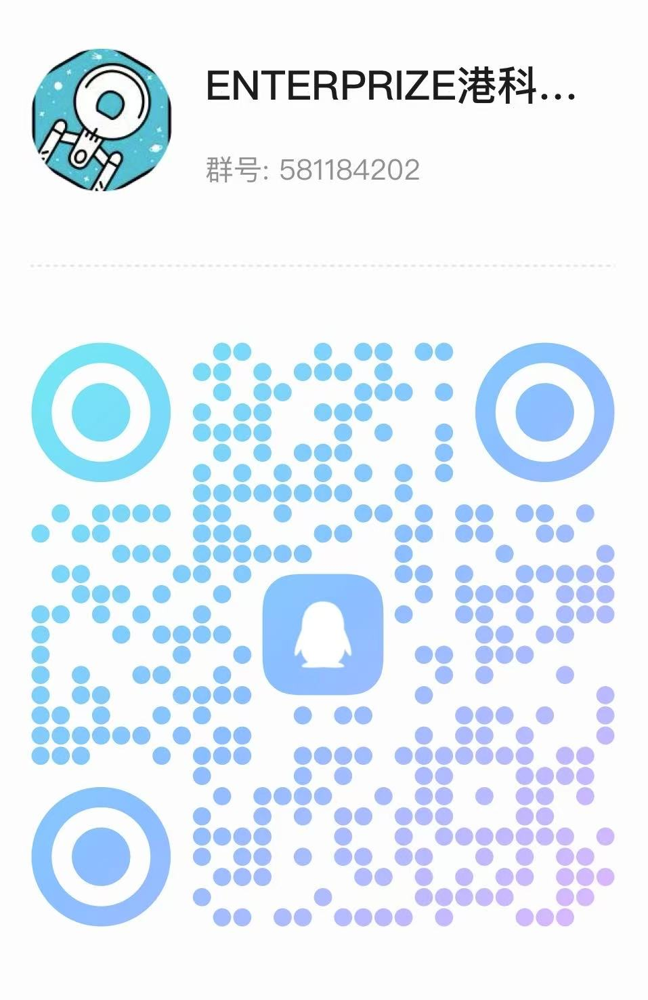

# HKUST ENTERPRIZE RoboMaster 2025 Radar Algorithm

<p align="center">
<a href="./LICENSE"></a>

<p align="center">
  
</p>

## 更新日志

- **2025.8.24**: 代码规范化整理，添加开源协议，删除无用工具文件
- **2025.8.9**: 
  - 删除无用config文件，加入Ultralytics训练配置
  - 开源Car Detector、Armor Detector及Pattern Classifier数据集
  - 更新装甲板分类器训练代码与指南
  - Release射线投影可视化交互式脚本
- **2025.8.3**: 第一版项目代码Released🎉
- **2025.8.24**: 根据官方开源评判规范修改README

## 开源协议

本项目基于[MIT许可证](LICENSE)开源。引用时请注明项目来源：香港科技大学ENTERPRIZE战队RoboMaster 2025雷达站算法开源项目。
## 目录
- [项目概述](#项目概述)
- [软件功能介绍](#软件功能介绍)
- [软件效果展示](#软件效果展示)
- [系统环境与依赖](#系统环境与依赖)
- [编译安装方式](#编译安装方式)
- [文件目录结构](#文件目录结构)
- [系统框图与数据流](#系统框图与数据流)
- [原理介绍与理论分析](#原理介绍与理论分析)
- [软件架构](#软件架构)
- [未来优化方向](#未来优化方向)
- [训练指南](#训练指南)
- [联系方式](#联系方式)

## 项目概述


雷达站作为RoboMaster比赛中的关键辅助兵种，需要在复杂赛场环境中稳定追踪双方机器人的运动状态。本系统通过创新的算法设计，解决了传统方案在遮挡处理、非平面场地定位、身份持续追踪等方面的痛点。

**核心贡献**：
- 🎯 创新的射线投射三维定位算法，适配复杂非平面场地
- 🛡️ 基于天然遮挡数据的深度学习检测模型
- 🔄 匈牙利匹配多目标追踪算法，解决身份混淆问题
- 📊 实时战术数据输出，支持决策系统

**竞赛成绩**：在2025赛季复活赛中表现优异，助力战队取得：
- 单局最高易伤时间：**1912.1s**
- 单局平均最高机器人易伤时间: **321.8s**
- 局均易伤时间：**1618.3s**
- 额外伤害：**420.2**

> 📋 技术详情请参考：[HKUST ENTERPRIZE RM2025 雷达站开源报告](docs/HKUST_ENTERPRIZE_RM2025_Radar开源报告.pdf)

## 软件功能介绍

### 核心技术亮点

#### 1. 专用数据集构建
针对比赛场景特点, 我们构建了包含复杂工况的高质量数据集:
- 数据来源: 官方直播图像以及各战队开源第一视角视频
- 标注内容: 机器人整体框、装甲板位置、机器人装甲板颜色以及是否存活
- 关键优化: 引入天然遮挡样本(非人工mask增强),实验表明显著提升模型鲁棒性

#### 2. 智能目标检测
- **多层级检测架构**：车辆检测(追踪) → 装甲板检测 → 图案识别
  - **机器人检测**: `YOLOv12-s` 模型(输入1280x1280)
  - **装甲板检测**: `YOLOv12-n` 模型(输入192x192)
  - **装甲板图案分类**: `MobileNet-V2`网络 (输入64x64)
- **复杂场景适应**：支持遮挡、低光照、快速移动等赛场复杂工况


#### 3. 三维空间定位
- **射线投射算法**：突破传统多层透视变换平面限制
- **3D坐标输出**：提供完整的(X,Y,Z)世界坐标
- **地形适配**：支持台阶、斜坡等非平面复杂地形
- **标定简单**: 仅需标定6个(最少4个点), 适合赛场快速部署

#### 4. 多目标追踪
- **身份管理**：基于固定目标池的兵种追踪, 利用历史类别分布以及几何空间约束构建"软外观模型"匹配代价, 通过匈牙利算法维持目标身份以及轨迹的连续性
- **状态管理与智能预测**：利用状态机管理10兵种轨迹信息, 结合卡尔曼滤波的进行运动预测与盲区猜点

## 软件效果展示

### 系统运行演示

*图1：系统实时运行效果演示*

### 检测效果展示

*图2：含遮挡场景的数据集样本与标注效果, 我们从官方的图片直播中获取了大量的带机器人遮挡的原始数据并且进行了人工标注, 相比于训练时引入遮挡等数据增强, 天然的遮挡训练集能大大增加模型对赛场复杂情况的适应性*

### 定位精度验证

*图3：射线投射三维定位可视化验证*

#### 交互式可视化界面

**Pre-requisite**
```
pip install open3d
```
1. 🔍 找到 `config/params.yaml` ，根据指示将实际上场相机参数 (`transform.K, transform.dist_coffs`) 替换为 demo 用参数
2. ▶️ 运行脚本 `python -m transform.ray_renderer`
3. 🎯 根据指示，在图片界面左键发射一条光线，右键绘制轨迹，实际投影呈现的效果会显示在 3D 图示中

### 竞赛数据展示

*图4：青工会竞赛数据面板展示*

*图5: 全国赛+复活赛局均易伤第一展示*


## 系统环境与依赖

### A. 硬件环境要求

**推荐配置**：
- **GPU**：推荐RTX3060及以上（实测RTX3060/RTX4060/RTX5070笔记本可稳定运行，帧率~10fps）
- **相机**: 推荐高分辨率工业相机

**上场设备**（参考配置）：
- 运算端：机械革命蛟龙16Pro/2025/RTX5070
- 工业相机：海康机器人工业相机2000万像素/USB3.0/MV-CS200-10UC
- 工业镜头：海康机器人2500万工业镜头/MVL-KF1224M-25MP1624c

### B. 软件依赖

**操作系统**：
- Ubuntu 22.04 LTS（推荐）

**核心依赖**：
```yaml
Python: "3.10.0"
PyTorch: "2.7.1+cu128"
TensorRT: "10.12.0.36"
OpenCV: "4.12.0"
NumPy: "2.1.2"
Ultralytics: "8.3.163"
Open3D: "0.19.0"
onnx: "1.17.0"
```
*注意, 以上是实际代码的配置,可以保证能够复现本项目, 如果有别的版本需求, 请参考pytorch, tensorrt以及ultralytics等官网教程进行实际配置*

## 编译安装方式

### 环境配置步骤


> 📚 详细环境配置指南：[Environment Setup](./docs/env.md)

## 文件目录结构

### 主要项目文件组织

```shell
.
├── config
│   ├── armor_training_config.yaml                # yolo装甲板训练参考配置
│   ├── botsort.yaml                              # botsort算法(检测阶段tracker)配置
│   ├── bytetrack.yaml                            # bytetrack算法(检测阶段tracker)配置
│   ├── car_training_config.yaml                  # yolo车辆检测训练配置
│   ├── device.yaml                               # 相机驱动设置
│   ├── guess_pts.yaml                            # 猜点逻辑(配置位置以及参数)
│   └── params.yaml                               # 主配置文件
├── demo
│   └── demo1.jpg                                 # demo投影算法用图片
├── docs/...                                      # README内文件
├── driver                                        # 驱动文件
│   ├── hik_camera                                # hik相机驱动
│   │   ├── hik.py                               
│   │   ├── mock_hik.py
│   │   ├── MvCameraNode-CH.csv
│   │   └── MvImport                  
│   └── referee                                   # 裁判系统驱动
│       ├── crc.py
│       ├── referee_comm.py
│       ├── serial_comm.py
│       ├── serial_protocol.py
│       ├── test.py
│       ├── test_referee_comm.py
│       └── usb.py
├── field                                         # 场地文件
│   ├── field_image.png                           # UI内二维平面场地背景文件
│   ├── RMUC2025_National.PLY                     # 25复活赛+国赛场地文件
│   └── RMUC2025_Regional.PLY                     # 25区域赛场地文件
├── interface
│   ├── calib_tutorial.jpg                        # UI内标点示意图
│   ├── core.py                                   # UI核心文件
│   └── interfactive_display.py                  
├── LICENSE                                       # 开源协议文件
├── main_event_loop.py                            # 推理主事件循环, 在UI界面标定成功后开启
├── main.py                                       # 程序入口
├── model
│   ├── armor_detector.py                         # 装甲板检测复合模块(装甲板位置检测+识别)
│   ├── armor_light_classifier.py                 # 灯条分类模块(基于传统方法,已经废弃)
│   ├── digit_classifier                          # 装甲板图案分类项目 (包含训练代码和推理代码)
│   │   ├── build_dataset.py
│   │   ├── __init__.py
│   │   ├── model.py
│   │   ├── predictor.py
│   │   ├── train.py
│   │   └── transform.py
│   ├── pfa_yolov5                                # 厦门理工yolov5的检测器
│   │   ├── __init__.py
│   │   ├── models
│   │   ├── predictor.py
│   │   └── utils
│   └── yolov12                                   # yolov12检测器
│       ├── predictor.py                          # 不带ultralytics-track方法的检测器
│       └── predictor_with_tracker.py             # 带ultralytics-track方法的检测器
├── README.md                                     # README文件
├── run_scripts                                   
│   ├── camera_capture.sh                         # 运行海康相机官方调试界面
│   ├── create_serial_loopback.sh                 # 创建一个串口的虚拟回环(debug裁判系统用)
│   └── run.sh                                    # 上场程序启动指令
├── tracker
│   ├── CascadeMatchTracker             
│   │   ├── detector.py                           # 全检测器, 输出融合检测
│   │   ├── guess_pts.py                          # 猜点逻辑
│   │   ├── kalman.py                             # 卡尔曼滤波器(包括bounding box和二维平面的滤波器)
│   │   ├── tracker.py                            # 匈牙利匹配追踪器
│   │   ├── type.py                               # 融合检测类型与机器人状态类型定义
│   │   └── utils.py                              # 工具文件
│   └── warmup_image.jpg                          # 预热推理用图片
├── transform
│   ├── keypoint_6_region.txt                     # 区域赛六个对应场地关键点
│   ├── keypoint_6.txt                            # 全国赛+复活赛六个对应场地关键点
│   ├── ray_renderer.py                           # 射线投影法主文件
│   ├── solidwork2uwb.py                          # 从场地世界坐标系转换成雷达uwb坐标系
│   └── solvepnp.py                               # solvepnp定义, 用于校准相机外参
├── utils
│   ├── average_meter.py                  
│   ├── config.py                                 # 用于将yaml文件配置转换成args配置格式
│   └── convert_pt2tensorrt.py                    # 将pt格式的yolo模型转换成tensorrt格式
```

## 系统框图与数据流

### 系统整体架构


## 原理介绍与理论分析

### 1. 射线投射三维定位算法

**传统方案局限性**：
- 透视变换依赖平面假设，在台阶、斜坡等复杂地形失效
- 多层变换需要复杂分层标定，精度难以保证

**本方案创新点**：
射线投射算法突破了传统透视变换的平面限制，通过构建从相机光心到像素点的射线，与精确的3D场地模型求交，直接获得世界坐标系下的三维位置。

**核心原理**：
1. **射线生成**：将像素坐标(u,v)通过相机内参矩阵反投影为三维射线
2. **模型求交**：射线与高精度场地网格模型进行几何求交运算
3. **坐标输出**：交点即为目标在世界坐标系中的真实位置

**理论支撑**：
- 基于计算机图形学射线追踪理论
- 相机成像几何学原理
- 三维空间解析几何

**精度分析**：
- 理论精度：
  - 取决于场地模型精度和相机标定质量
  - 精度还受到检测本身噪音影响, 且在对方高地下由于投影歧义导致检测精度较差(然而经过调参仍然能够达到 < 1.6m)
- 鲁棒性：不受地形复杂度影响，适配任意非平面地形

### 2. 多层级深度学习检测架构

**设计理念**：
采用"粗到细"的检测策略，通过三个递进的检测阶段平衡精度与速度：

**架构组成**：
- **Stage 1 - 车辆粗检测**：YOLOv12-s在全图(1280×1280)检测车辆区域
- **Stage 2 - 装甲板精检测**：YOLOv12-n在车辆ROI(192×192)精确定位装甲板
- **Stage 3 - 图案分类**：MobileNetv2对装甲板图案(64×64)进行兵种识别

**网络选择依据**：
- **YOLOv12-s**：平衡精度与速度，适合大图像车辆检测
- **YOLOv12-n**：轻量化网络，满足实时性要求
- **MobileNetv2**：极致轻量，保证分类精度达99.99%

**技术优势**：
- 渐进式检测降低计算复杂度
- 分阶段处理适应不同检测精度需求
- 模块化设计便于独立优化和替换

### 3. 匈牙利算法多目标追踪

**问题建模**：
多目标追踪本质上是一个二分图最优匹配问题，需要在当前帧检测结果与历史轨迹间找到最优分配关系。

**核心机制**：
1. **代价矩阵构建**：融合IoU距离、位置距离、类别相似度等多维特征
2. **匈牙利求解**：使用Kuhn-Munkres算法求解最小代价匹配
3. **状态机管理**：维护目标的生命周期状态转换

**状态机设计**：
- **INACTIVE**：目标池中未激活的兵种槽位
- **TENTATIVE**：新检测到的候选目标，需连续匹配确认
- **CONFIRMED**：已确认的稳定追踪目标
- **LOST**：暂时丢失但保持预测的目标

**算法优势**：
- 全局最优匹配，避免局部贪心导致的身份混淆
- 历史特征多融合提升匹配鲁棒性
- 状态机制有效处理目标出现/消失/遮挡情况

### 4. 卡尔曼滤波运动预测

**理论基础**：
基于线性动态系统理论，假设目标运动符合恒速度模型，通过状态方程和观测方程实现预测与校正。

**状态空间建模**：
- 状态向量：[x, y, vx, vy] (位置+速度)
- 预测阶段：根据运动模型预测下一时刻状态
- 更新阶段：融合观测信息校正预测结果

**应用优势**：
- 平滑轨迹，减少检测噪声影响
- 预测目标位置，辅助匹配算法
- 处理短时遮挡，维持追踪连续性

## 软件架构
本项目基于事件驱动架构设计，通过用户界面的信号量机制实现对模型加载、推理执行、相机内参调节及外参标定等关键流程的统一调度。结合 YAML 配置文件的支持，系统具备良好的模块化特性与运行时可配置性，有效增强了整体灵活性与可维护性。

### 软硬件层级架构图


## 训练指南

### 数据集准备

**数据集链接:** 

[ENTERPRIZE战队2025赛季开源标注数据集(密码:987654321)](https://hkustconnect-my.sharepoint.com/:f:/g/personal/zguobd_connect_ust_hk/EvYDNGry-DBBjr9eSzpacGcBPlSS7KpMZmSE3KGzeJMJKw)

[ENTERPRIZE战队2025赛季雷达第一视角视频开源(密码987654321)](https://hkustconnect-my.sharepoint.com/:f:/g/personal/zguobd_connect_ust_hk/Em-C9pLwhhtJnkbOREwY9C0B37jB_n-zCewAGKSgpXGVSQ?e=MwoMSc)


***Remark***：为了达到最佳的训练效果，请不要**仅仅**依赖于我们提供的数据集进行训练，可以参考我们在报告中提到的数据集制作思路自主标注相关数据；本数据集开源仅作为参考。

1. 一阶段机器人（车辆）识别数据：
   - 共计**3022**个数据
   - *标签定义*：0 -> 机器人

2. 二阶段装甲板识别数据：
   - 共计**3504**个数据
   - *标签定义*：0 -> 死亡状态装甲板；1 -> 红色灯条装甲板；2 -> 蓝色灯条装甲板

3. 三阶段装甲板图案识别数据：
   - 共计**3528**个数据
   - *标签定义*：首字母B/R -> 蓝色/红色（训练中会自动混合）；第二个字符：0 -> 前哨站；1-5 -> 1-5号装甲板（5号不会参与训练，但是在此仍提供出来）；S(6) -> 哨兵

### 训练步骤

#### 1. Car Detector
- 使用Ultralytics的训练接口
- 训练config参考 `./config/car_training_config.yaml`


*只使用我们开源训练集进行Car Detector的训练,复现效果如图所示*

#### 2. Armor Detector
- 使用Ultralytics的训练接口
- 训练config参考: `./config/armor_training_config.yaml`

#### 3. Digit Classifier
训练代码
```shell
python -m model.digit_classifier.train --dataset-path /path/to/your/dataset --batch-size 32
```
#### MobileNET-v2
训练代码
```python
python -m model.digit_classifier.train --dataset-path /path/to/your/dataset --batch-size 32
```
*其中数据集格式要求为*
``` shell
/dataset
  /train
    /B1
    /B2
    /B3
    ...
    /R1
    /R2
    /R3
    ...
  /val
    /B1
    /B2
    /B3
    ...
    /R1
    /R2
    /R3
    ...
  
```
*由于不知道读者具体训练需求, train-val split留给读者自定义处理*

### 将训练得到的YOLO模型转化为TensorRT
```shell
python -m utils.convert_pt2tensorrt
```

### 快速运行

```bash
# 赋予执行权限
chmod +x run_scripts/*.sh

# 运行主程序
./run_scripts/run.sh
```
注意：可在```config/params.yaml```文件中选择使用导入视频（```inference_video```）或者实时相机数据（```streaming_video```）

## 未来优化方向

### RoadMap 

#### 1. 模型性能提升
- 引入更先进的 Transformer 架构，如 DETR 系列模型。
- 探索多模态融合（视觉 + 激光雷达），提升复杂环境适应性。

#### 2. 与哨兵信息的融合
- 可以结合哨兵返回的己方机器人坐标，在匈牙利匹配对己方机器人引入
额外的匹配权重，从而显著加强对方机器人匹配的准确度。

#### 3. 引入相对动态匹配机制
## 联系方式

欢迎通过以下方式联系我们，强烈推荐加入官方开源交流QQ群：

- **作者邮箱**: zguobd@connect.ust.hk / szhoubx@connect.ust.hk
- **作者微信**: guozilin200429 / s9647814  
- **QQ交流群**: 581184202
- **微信公众号**: HKUST ENTERPRIZE (ID: gh_855d709c046e)
- **Bilibili**: 港科大ENTERPRIZE战队 (UID: 634988052)

若您在项目中受益于我们的工作，请在引用中注明来源，并为我们的Github项目点Star⭐。让我们携手共建鼓励创新、协作与超越的RM开源生态！🎉

<p align="center">
  
</p>